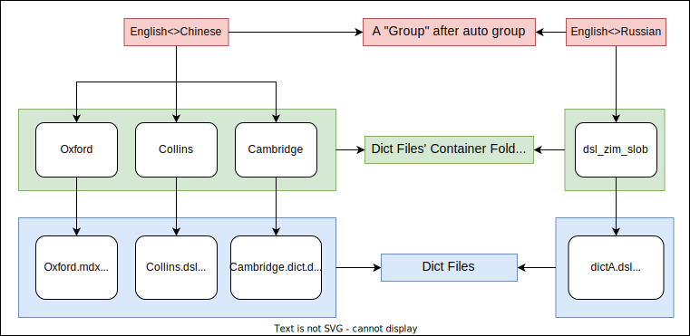

Here you can create and edit dictionary groups. To add dictionary into group just drag it into groups window, to remove it drag it back to dictionaries list. Also you can press "Auto groups button" to automatically create groups for all presented in dictionaries list language directions. Via context menu of such automatically created groups you can execute additional dictionaries grouping by source or target language and combine dictionaries in more large groups.

## Group by dictionary language

When group by dictionary language,the language is taken from dictionary's built-in metadata which has been embed when creating dictionary.

If the language is not present in the dictionary,  it will try to detect the language from dictionary file name.

Then use the founded language to create dictionary groups.


## Auto groups by folders

Click the "Auto groups by folders" will group your dicts based on folder structure.

Two dictionaries will be in the same group if their container folder's direct parent are the same.



For example, the structure below will be auto grouped into two groups:

* `English<>Chinese` with `Cambridge`, `Collins` and `Oxford`
* `English<>Russian` with `dictA`, `dictB`, `Wikipedia_ru` and `Wikipedia`

```
.
├── English<>Chinese
│   ├── Cambridge
│   │   ├── Cambridge.dict.dz
│   │   ├── Cambridge.idx
│   │   ├── Cambridge.info
│   │   └── Cambridge.syn
│   ├── Collins
│   │   ├── Collins.dsl
│   │   └── res.zip
│   └── Oxford
│       ├── Oxford.css
│       ├── Oxford.mdd
│       └── Oxford.mdx
└── English<>Russian
    ├── dsl
    │   ├── dictA.dsl
    │   └── dictB.dsl
    └── zim
        ├── Wikipedia_ru.slob
        └── Wikipedia.zim
```

Note that if two groups share the same name but in different folder, then upper level's folder name will be prepended with group name. The Example below will be grouped into `epistularum/Japanese` and `Mastameta/Japanese`.

More levels of folder nesting are not supported.

```
.
├─epistularum
│   └─Japanese   <- Group
│       └─DictA  <- Dict Files's container folder
|          └─ DictA Files
├─Mastameta
│   └─Japanese   <- Group
|       └─DictB  <- Dict Files's container folder
|          └─ DictB Files  
```

## group by metadata.toml

Click the "group by metadata" will group your dicts based on metadata.toml file.

the location of the metadata file is at the same location as the dictionary.

The structure of the metadata file use [toml](https://toml.io) format
```
category = [ "english", "yellow", "green" ]

# the following fields have not supported yet.
[metadata]
name = "New Name"
langfrom = "English"
langto = "Russian"
```


For example, 

```
.
English<>Chinese
── Cambridge
   ├── Cambridge.dict.dz
   ├── Cambridge.idx
   ├── Cambridge.info
   └── Cambridge.syn
   └── metadata.toml     (A)
── Collins
   ├── Collins.dsl
   └── res.zip
   └── metadata.toml (B)  

```

The content of the metadata(A) is
```
category=["en-zh","汉英词典"]
```


The content of the metadata(B) is
```
category=["图片词典","en-zh","汉英词典"]
```

the structure below will be auto grouped into three groups:

* `en-zh` with `Cambridge`, `Collins` 
* `图片词典` with `Collins` 
* `汉英词典` with `Cambridge`,`Collins` 

Note: you can configure only the dictionaries you like .